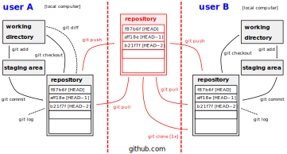

<title>UNIX/Linux and git training 22nd Sep 2020</title>
# UNIX/Linux and git training 22nd Sep 2020

## Instructors 

* Margaret Duff (UNIX/Linux)
* James Grant (RSE)
* Will Graham
* Eike Mueller (git)

## Schedule

| time            |                            |
| --------------- | -------------------------- |
| 09:15h - 09:20h | Welcome (Eike)             |
| 09:20h - 10:30h | **S1a: UNIX/Linux** (Margaret) |
| 10:30h - 11:00h | break                      |
| 11:00h - 12:30h | **S1b: UNIX/Linux** (Margaret) |
| 12:30h - 13:30h | _lunch break_              |
| 13:30h - 13:40h | Research Software Engineering (James) |
| 13:40h - 15:00h | **S2a: git** (Eike)          |
| 15:00h - 15:30h | _break_                    |
| 15:30h - 17:00h | **S2b: git** (Eike)          |

to join the meeeting, go to [channel on Mircosoft Teams](https://teams.microsoft.com/l/channel/19%3a795283aae47a4006819fa593e4a6523e%40thread.tacv2/UNIX%2520and%2520git?groupId=e35d509e-83cc-4208-ae1d-7e9f096d6dd9&tenantId=377e3d22-4ea1-422d-b0ad-8fcc89406b9e) which contains a scheduled meeting for the entire day.

## Training material
* [UNIX/Linux tutorials](https://arc-lessons.github.io/intro-linux/00_schedule.html) (use this for sessions S1a & S1b)
* [git tutorials](<https://arc-lessons.github.io/version-control-git/00_schedule.html>) (use this for sessions S2a & S2b)
* [slides Unix/Linux](https://people.bath.ac.uk/em459/samba_training/slides/slides_unix.pdf)
* [slides git](https://people.bath.ac.uk/em459/samba_training/slides/slides_git.pdf)

## Cloud-server for interactive exercises
[Jupyterhub server](https://dev.jupyterhub.bath.ac.uk)

## Things to do

### ...before 22nd Sep
* Make sure that you have a Bath University computer account
* Set up VPN on your computer, as explained [here](https://www.bath.ac.uk/guides/setting-up-vpn-on-your-device/)
* Check that you can access the training material and the Jupyterhub server (see below)

### ...in the lunchbreak on 22nd Sep
* Create an account on [github](https://www.github.com). Use your Bath University email address, e.g. `em459@bath.ac.uk`
* Fill out the [spreadsheet with your contact details](https://docs.google.com/spreadsheets/d/1pvtEDYiz_PqowN8qmvwqketSQolj4O4VhBc1o-umHvg/edit?usp=sharing) for the github pair exercise

## Other links
* [github](https://www.github.com)
* [git book](https://git-scm.com/book)
* [git reference](https://git-scm.com/docs)

## git summary in one diagram

